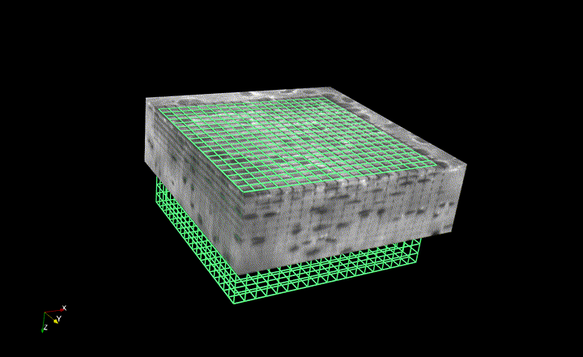

Please find the official documentation [here](http://lsmgridtrack.readthedocs.io/en/master/).

OVERVIEW
==========

lsmgridtrack is a Python module providing a framework for deformable image registration of 3D images from multiphoton laser scanning microscopy. It is aimed at a technique involving the photobleaching of a 3D grid onto the image and then observing this grid region in unloaded and loaded states.

Unlike confocal microscopes, multiphoton laser scanning microscopes can target a precise excitation volume. This allows for local photobleaching not only in the x-y plane but also the z, and thus a 3D grid can be drawn on fluorostained tissue. An example of such a grid photobleached onto a microscopic region (200x200x100 microns) of articular cartilage is shown below.

By using custom mechanical testing systems that allow for sample imaging while under known applied mechanics, this grid can be observed in the tissue under different deformed states. Registering the undeformed and deformed images then allows for the determination of the grid deformation. Below, the calculated grid deformation between the undeformed tissue state shown above to a 30% applied nominal compressive strain is shown.

From the grid vertex displacements, lsmgridtrack automatically calculates the deformation gradient at each grid cell centroid. From the deformation gradient, any kinematic variable can be determined. The Green-Lagrange strains, principal strains, maximum shear strains, and volumetric strains are calculated automatically. These can then be saved in different formats, such as a VTK image. 
